# Deliberation Knowledge Graph Model

This document presents the knowledge graph model that shows connections between different argumentation ontologies, deliberation ontologies, and the actual datasets in this repository.

## Knowledge Graph Model Diagram

```mermaid
graph TD
    %% Main Knowledge Graph Node
    DKG[Deliberation Knowledge Graph]
    
    %% Ontology Categories
    AO[Argumentation Ontologies]
    DO[Deliberation Ontologies]
    LO[Legal Ontologies]
    
    %% Specific Ontologies
    AIF[Argument Interchange Format]
    AMO[Argument Ontology]
    SIOC[SIOC Argumentation]
    IBIS[Issue-Based Information System]
    
    DELIB[DELIB Ontology]
    DelibO[Deliberation Ontology]
    PartO[Participation Ontology]
    ConsO[Consensus Ontology]
    
    LKIF[LKIF-Core]
    OGD[Open Government Data Ontology]
    
    %% Datasets
    DS1[Decide Madrid]
    DS2[DeliData]
    DS3[EU Have Your Say]
    DS4[Habermas Machine]
    DS5[Decidim Barcelona]
    DS6[US Supreme Court Arguments]
    
    %% Core Concepts
    CC1[Deliberation Process]
    CC2[Participants]
    CC3[Arguments & Contributions]
    CC4[Information Resources]
    CC5[Fallacy Detection]
    CC6[Cross-Dataset Integration]
    
    %% Connections between DKG and Ontology Categories
    DKG -->|integrates| AO
    DKG -->|integrates| DO
    DKG -->|integrates| LO
    
    %% Connections between Ontology Categories and Specific Ontologies
    AO -->|includes| AIF
    AO -->|includes| AMO
    AO -->|includes| SIOC
    AO -->|includes| IBIS
    
    DO -->|includes| DELIB
    DO -->|includes| DelibO
    DO -->|includes| PartO
    DO -->|includes| ConsO
    
    LO -->|includes| LKIF
    LO -->|includes| OGD
    
    %% Connections between DKG and Core Concepts
    DKG -->|models| CC1
    DKG -->|models| CC2
    DKG -->|models| CC3
    DKG -->|models| CC4
    DKG -->|models| CC5
    DKG -->|models| CC6
    
    %% Connections between Datasets and DKG
    DS1 -->|mapped to| DKG
    DS2 -->|mapped to| DKG
    DS3 -->|mapped to| DKG
    DS4 -->|mapped to| DKG
    DS5 -->|mapped to| DKG
    DS6 -->|mapped to| DKG
    
    %% Connections between Datasets and Specific Ontologies
    DS1 -->|uses concepts from| DELIB
    DS1 -->|uses concepts from| SIOC
    
    DS2 -->|uses concepts from| AIF
    DS2 -->|uses concepts from| IBIS
    
    DS3 -->|uses concepts from| OGD
    DS3 -->|uses concepts from| LKIF
    
    DS4 -->|uses concepts from| AMO
    DS4 -->|uses concepts from| ConsO
    
    DS5 -->|uses concepts from| PartO
    DS5 -->|uses concepts from| DELIB
    
    DS6 -->|uses concepts from| LKIF
    DS6 -->|uses concepts from| AIF
    
    %% Connections between Core Concepts and Specific Ontologies
    CC1 -->|represented in| DELIB
    CC1 -->|represented in| DelibO
    
    CC2 -->|represented in| PartO
    CC2 -->|represented in| SIOC
    
    CC3 -->|represented in| AIF
    CC3 -->|represented in| AMO
    CC3 -->|represented in| IBIS
    
    CC4 -->|represented in| LKIF
    CC4 -->|represented in| OGD
    
    CC5 -->|represented in| AIF
    CC5 -->|represented in| AMO
    
    CC6 -->|represented in| SIOC
    CC6 -->|represented in| DELIB
    
    %% Style
    classDef ontologyCategory fill:#f9f,stroke:#333,stroke-width:2px
    classDef ontology fill:#bbf,stroke:#333,stroke-width:1px
    classDef dataset fill:#bfb,stroke:#333,stroke-width:1px
    classDef concept fill:#fbb,stroke:#333,stroke-width:1px
    classDef mainNode fill:#ff9,stroke:#333,stroke-width:4px
    
    class DKG mainNode
    class AO,DO,LO ontologyCategory
    class AIF,AMO,SIOC,IBIS,DELIB,DelibO,PartO,ConsO,LKIF,OGD ontology
    class DS1,DS2,DS3,DS4,DS5,DS6 dataset
    class CC1,CC2,CC3,CC4,CC5,CC6 concept
```

## Detailed Mappings

### Mapping Datasets to Ontologies

1. **Decide Madrid Dataset**
   - Maps to DELIB Ontology for e-participation concepts
   - Maps to SIOC for online discussion structure
   - Primary entities: proposals, comments, users, votes

2. **DeliData Dataset**
   - Maps to AIF for argument structure representation
   - Maps to IBIS for issue-position-argument modeling
   - Primary entities: group chats, messages, solutions, performance metrics

3. **EU Have Your Say Dataset**
   - Maps to OGD Ontology for government data representation
   - Maps to LKIF for legal document references
   - Primary entities: initiatives, feedback, publications, attachments

4. **Habermas Machine Dataset**
   - Maps to Argument Ontology for structured argumentation
   - Maps to Consensus Ontology for preference formation
   - Primary entities: candidate comparisons, preference rankings, position statements

5. **Decidim Barcelona Dataset**
   - Maps to Participation Ontology for civic engagement
   - Maps to DELIB for deliberation processes
   - Primary entities: participatory processes, proposals, comments, votes

6. **US Supreme Court Arguments Dataset**
   - Maps to LKIF for legal reasoning
   - Maps to AIF for argument structure
   - Primary entities: cases, arguments, justices, advocates, transcripts

### Core Concept Integration

The Deliberation Knowledge Graph integrates these diverse datasets and ontologies through the following core concepts:

1. **Deliberation Process**
   - Standardizes the representation of deliberative activities across platforms
   - Connects formal and informal deliberation contexts
   - Provides temporal and procedural structure

2. **Participants**
   - Unifies participant representation across different platforms
   - Models roles, affiliations, and participation patterns
   - Enables cross-platform identity reconciliation

3. **Arguments & Contributions**
   - Standardizes argument structure for cross-platform analysis
   - Preserves platform-specific features while enabling interoperability
   - Supports both formal and informal argumentation patterns

4. **Information Resources**
   - Links to external knowledge sources referenced in deliberations
   - Connects legal frameworks with deliberative content
   - Provides context for understanding deliberative content

5. **Fallacy Detection**
   - Implements structures for identifying logical fallacies
   - Standardizes premise-conclusion relationships
   - Enables automated reasoning about argument quality

6. **Cross-Dataset Integration**
   - Provides mapping mechanisms between heterogeneous data sources
   - Standardizes common fields and structures
   - Enables unified querying across multiple deliberation platforms
